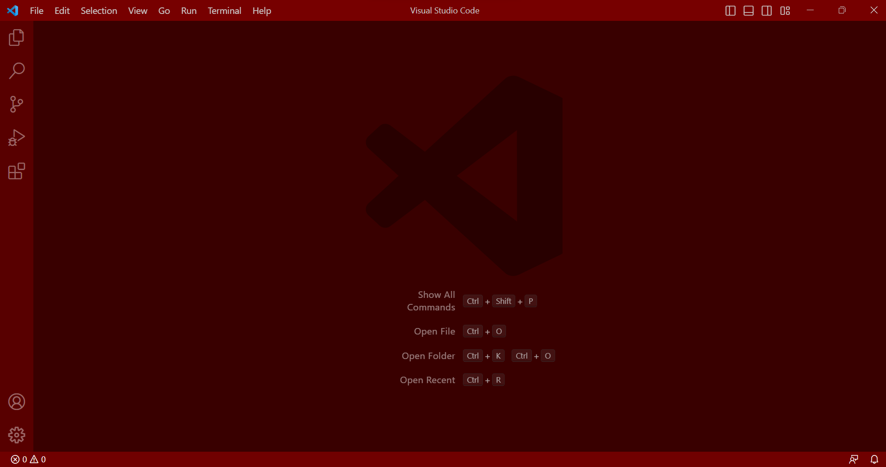
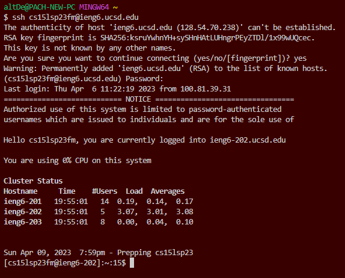
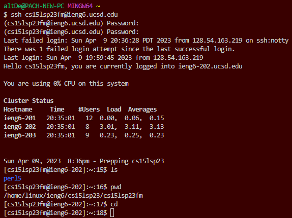
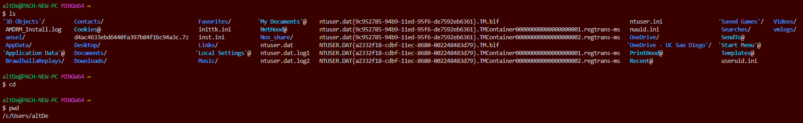

# **Greetings!**
Today we will show you how to successfully log into a course-specific account on `ieng6` using Visual Studio Code! After confirming you have your school account set up and working, there are three main steps you must follow to make sure you are connected remotely! These steps include: 

1. Installing Visual Studio Code
2. Remotely Connecting
3. Trying Some Commands

---
## Step 1: Installing Visual Studio Code
Visit the VScode website [VSCode Download](https://visualstudio.microsoft.com/downloads/) and follow the instructions to download the software on your computer. After installing it fully and opening it, you should see a screen similar to: 


## Step 2: Remotely Connecting
Once VScode is up and running, now we must connect to the remote server. To do so, we need to first install git, which will be very useful for connecting:

[git Download](https://gitforwindows.org/)

After downloading and going through the full installation, return to VScode and open a new terminal. This can be done by going: Terminal → New Terminal menu option, or using the shortcut Ctrl or Command + `. This is where you will connect to the server using your login information. **Remember: This account is different than your standard UCSD account!** To access it head to this website: 

[Account Lookup](https://sdacs.ucsd.edu/~icc/index.php)

Once you find you account, you will have to reset your password using the following website. **Remember to each instruction carefully!**

[Password Reset Guide](https://drive.google.com/file/d/17IDZn8Qq7Q0RkYMxdiIR0o6HJ3B5YqSW/view)

After opening the git bash terminal copy and paste this command (not including the $ sign!). Before inputting the command, make sure to replace ‘zz’ with your course-specific account letters:

`$ ssh cs15lsp23zz@ieng6.ucsd.edu`

This is your first time connecting to a new server, so you will get a message similar to:

```
⤇ ssh cs15lsp23zz@ieng6.ucsd.edu

The authenticity of host 'ieng6.ucsd.edu (128.54.70.227)' can't be established.

RSA key fingerprint is SHA256:ksruYwhnYH+sySHnHAtLUHngrPEyZTDl/1x99wUQcec.

Are you sure you want to continue connecting (yes/no/[fingerprint])?
```
Enter `yes`, and it should not reappear frequently if connecting to the same server. Next, it will prompt you to enter your password. **Remember: When writing the password, it will seem like you are not typing, but it is invisible, so make sure you put the password in carefully!**

If you successfully login, you will see a message like:
```
# Now on remote server
Last login: Sun Jan  2 14:03:05 2022 from 107-217-10-235.lightspeed.sndgca.sbcglobal.net
quota: No filesystem specified.
Hello cs15lsp23zz, you are currently logged into ieng6-203.ucsd.edu


You are using 0% CPU on this system


Cluster Status 
Hostname     Time    #Users  Load  Averages  
ieng6-201   23:25:01   0  0.08,  0.17,  0.11
ieng6-202   23:25:01   1  0.09,  0.15,  0.11
ieng6-203   23:25:01   1  0.08,  0.15,  0.11


Sun Jan 02, 2022 11:28pm - Prepping cs15lsp23

```
This is what it looks like in the terminal:



Now we are successfully connected to the remote server! Let's get to testing by running some commands


## Step 3: Trying Some Commands
Try running commands on both your own computer and the remote computer, and see what happens; Do they successfully return an output, do they return errors, etc.
Try:
* `ls -lat`
* `ls -a`
* `cd ~`
* `ls <directory> where <directory> is `
* `cd`
* `cat /home/linux/ieng6/cs15lsp23/public/hello.txt`





These commands are run on both the local computer and the remote computer, and it seems like it works!
