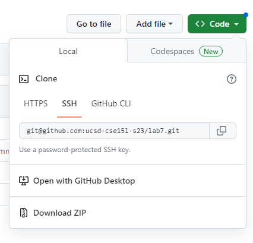
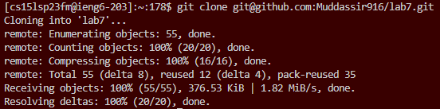
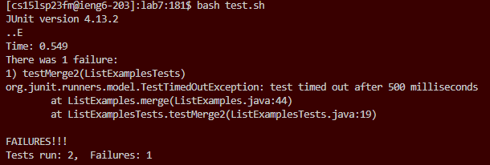
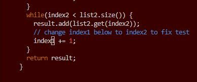
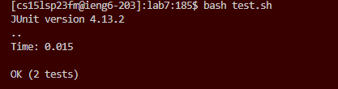
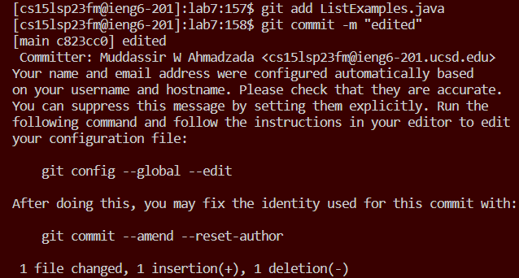
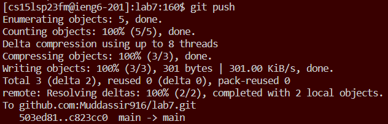

# **Greetings!**
Today we will show how to clone a fork of a repository, run the code, edit errors, then lastly commit and push the correctly edited code to your GitHub account, all from the comfort of your terminal! 

## Step 1: Login and Fork Repository
For the purpose of learning how to save modifications of a repository, we will work with [this repository](https://github.com/ucsd-cse15l-s23/lab7). Before logging into your `ieng6` account, make sure to fork the repository, so that we can access it later in the terminal. 

As always, launch your terminal and log in using the command `ssh cs15lsp23zz@ieng6.ucsd.edu` (the `zz` being replaced by the account-specific combination). If you have set up a SSH key for your `ieng6` account, you will be logged in automatically afterward, otherwise, enter your password to access the remote server.  

After we have successfully logged in, it is time to clone the repository using the SSH option for cloning on the repository:

Once you are ready to clone, type this specific command: `git clone git@github.com:ucsd-cse15l-s23/lab7.git` (the `ucsd-cse15l-s23` being replaced with your GitHub username):

## Step 2: Run and Edit the Tests
After we successfully set up the clone in our terminal, we will now run the code and try to see what modifications we can make to help our code run. Run the code by:
* First make sure you are in the correct directory `lab7`, if you are not yet, type `cd lab7`:

* Type `bash test.sh`
After doing so, we can see the tests do not pass

After running the tests, we are able to locate where the error originates:

Now we have to modify the code to make the tests run correctly. 

* First, make sure you are still in the correct directory `lab7`:

* Next, with these specific keystrokes, 1.) `vim ListExamples.java`, `<enter>`, (open the file where the error is in vim). 2.) `/index1`, `<enter>` (search for `index1` within the file). 3.) `n`,`n`,`n`,`n`,`n`,`n`,`n`,`n`,`n` (press `n` 9 times to reach the `index1` that needs to be changed to `index2`). 4.) `<esc>`, `l`, `l`, `l`, `l`, `l` (moves the cursor 5 to the right, directly placing it on the `1` in `index1`). 5.) `x`, `i`, `2`, `<esc>`, `:wq`, <enter> (This removes the `1`, goes into insert mode, adds `2`, and saves and exits vim).

Then, we rerun the tests, using `bash test.sh`

And as we can see, it passes with flying colors!

## Step 3: Commit and Push the Changes
Now that we have successfully edited the code to ensure the tests work, we will make sure our changes are reflected on our GitHub. This is done easily by the following lines of code:
* First, type in the terminal `git add ListExamples.java` (adds the edited version of the code).
* Next, type `git commit -m "edited"` (`"edited"` being any commit message you choose!).
* Finally, type `git push` (pushes it to your GitHub).

And just like that, we cloned a fork of the repository, ran the code, edited the errors, and finally committed and pushed the correctly edited code to our GitHub account, all from the comfort of our terminal!
